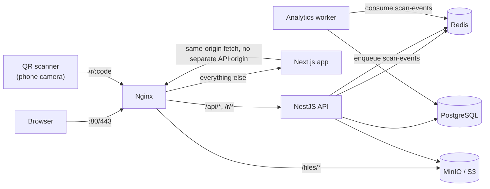
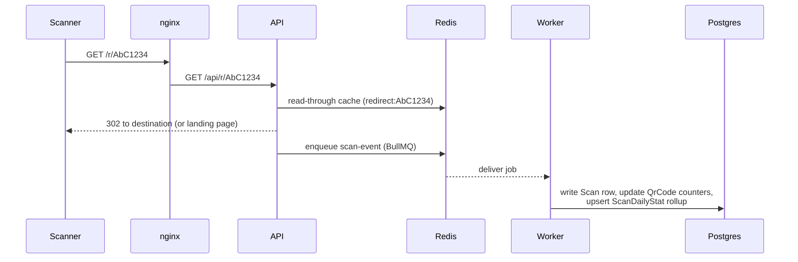

# Architecture

## System overview

Every component is a separate Docker Compose service (see [docs/DEPLOYMENT.md](DEPLOYMENT.md)).
nginx is the only one that publishes a port to the host - the browser and QR scanners only ever
talk to nginx, which routes by path:

| Path            | Routed to                                     |
| --------------- | --------------------------------------------- |
| `/r/*`          | API (rewritten to `/api/r/*` - see below)     |
| `/api/*`        | API, unmodified                               |
| `/files/*`      | MinIO (uploaded logos/images, anonymous-read) |
| everything else | Next.js                                       |

## Why the API's real routes live under `/api`, but printed QR codes say `/r`

Every backend route is internally prefixed with `/api` (global prefix + URI versioning, e.g.
`/api/v1/qr-codes`), including the redirect controller at `/api/r/:code` - but a _printed_ QR
code needs the shortest, most stable URL possible, so the public-facing short link is
`https://your-domain/r/AbC1234`, with no `/api`. nginx bridges the two with a plain rewrite
(`infra/docker/nginx/conf.d/default.conf`) rather than trying to make the backend serve two
different prefixes for the same route. The tradeoff: anything that talks to the backend directly

- e2e tests, `curl` during development - has to know about the real `/api/r/*` path; only
  requests that go through nginx see the short public form.

## Monorepo structure

pnpm workspaces + Turborepo. `apps/api` and `apps/web` depend on `packages/shared` and (api only
transitively, via qr-engine) `packages/qr-engine`; both packages compile to `dist/` and are
consumed like any other npm dependency - Turborepo's task graph (`turbo.json`,
`dependsOn: ["^build"]`) makes sure a package's dependencies are built before it is, for both
`build` and `typecheck`/`test`.

- **`packages/shared`** - Zod schemas are the single source of truth for validation. The backend
  wraps them with `nestjs-zod`'s `createZodDto()` for request validation; the frontend uses the
  _exact same_ schema objects with `react-hook-form`'s `zodResolver`. A validation rule only ever
  needs to change in one place.
- **`packages/qr-engine`** - an isomorphic SVG QR renderer built on the `qrcode` package's matrix
  encoding. Ships two entry points via `package.json`'s `exports` map: the default export is
  browser-safe (used for the live preview while editing a QR code) and `@qrgen/qr-engine/server`
  additionally pulls in `sharp`/`pdfkit` for server-only raster/PDF/EPS export - importing the
  server entry point from browser code is a build-time error, not just a runtime footgun.
- **`apps/api`** - NestJS. One codebase, two entry points (`main.ts` for the HTTP API,
  `worker.ts` for the analytics queue consumer - see below), both compiled by the same `nest
build` since both live under `src/`.
- **`apps/web`** - Next.js App Router. Talks to the API via a same-origin relative path
  (`/api/v1/...`) in both development (via a Next.js rewrite to `localhost:4000`) and production
  (nginx routes it directly) - the browser never needs to know the API's real origin or deal
  with CORS.

## Redirect path: latency vs. analytics completeness

A scan has two very different jobs to do, with very different latency budgets: redirect the
visitor _immediately_, and record detailed analytics, which can afford to happen a few hundred
milliseconds later without anyone noticing. Coupling them would mean every scan's redirect
latency includes a geo-IP lookup, user-agent parsing, and a database write - unnecessary
weight on the one part of the request that a real person is actually waiting on.

The redirect handler resolves the short code through a **read-through Redis cache**
(`RedirectCacheService`, 60s TTL) instead of a Postgres read on every scan, then enqueues a
`scan-event` job (BullMQ, backed by the same Redis) and responds - the queue write is the only
thing on the redirect's critical path, and it's fire-and-forget from the handler's perspective.
The worker (`apps/api/src/worker.ts`, `worker` service in docker-compose.yml) is a separate Nest
application context with no HTTP listener, consuming that queue: it geo-locates the IP,
parses the user agent, writes the raw `Scan` row, updates the QR code's denormalized scan
counters, and upserts the `ScanDailyStat` daily rollup that the analytics dashboards actually
query (so a chart never has to aggregate raw scan rows on the fly).

**Consistency tradeoff.** Because the redirect path reads from a 60-second cache rather than
Postgres directly, scan-limit and expiry enforcement is only _eventually_ consistent within that
window: a QR code that hits its scan limit or expires can still serve a handful of redirects for
up to 60 seconds afterward, and an edit to a dynamic QR code's destination can take up to 60
seconds to show up for scanners (the QR codes module explicitly invalidates the cache entry on
every write, so in practice this only matters for expiry/scan-limit thresholds crossed by the
passage of time rather than by an edit). This is a deliberate choice: enforcing hard consistency
would mean a synchronous Postgres read on every single scan, which is the exact cost this
architecture exists to avoid. If your use case genuinely needs sub-60-second enforcement
precision, lower `TTL_SECONDS` in `RedirectCacheService` - the correctness/latency tradeoff is
tunable, just not eliminable without removing the cache entirely.

## Scaling the `Scan` table

`Scan` is an append-only, high-write-volume table (one row per QR code scan, ever) with two
narrow, targeted indexes (`[qrCodeId, scannedAt]`, `[qrCodeId, country]`,
`[qrCodeId, deviceType]`) rather than one wide covering index, since analytics queries filter on
one dimension at a time. At low-to-moderate volume (a few million scans) this is fine as-is on
stock PostgreSQL.

At sustained high volume (tens of millions+ of scans/month), the standard mitigation is to
convert `Scan` to a **partitioned table** (native Postgres declarative partitioning, e.g. monthly
range partitions on `scannedAt`), which Prisma doesn't manage natively - you'd add the
partitioning via a raw-SQL migration (`prisma migrate dev --create-only`, then hand-edit the
generated SQL) after the initial table exists, and handle partition rollover with a small cron
job or `pg_partman`. This keeps recent-scan queries (which dashboards overwhelmingly are) fast
by only touching the relevant partition(s), and makes pruning old raw scan data (if your
retention policy calls for it) a cheap `DROP PARTITION` instead of a slow bulk `DELETE`. The
`ScanDailyStat` rollup table is unaffected either way - it's small (one row per QR code per day)
regardless of how many raw scans feed into it, and is what dashboard charts query by default.

## Security-relevant design decisions

- **Password hashing**: argon2id (both account passwords and the optional redirect-gate
  password on a QR code) via the `argon2` package, not bcrypt - argon2id is the current OWASP
  recommendation and has configurable memory-hardness against GPU cracking.
- **Sessions**: short-lived (15 min default) JWT access tokens plus long-lived, rotating refresh
  tokens. A refresh token is single-use - presenting one issues a new one and revokes the old,
  and presenting an _already-revoked_ token (a strong signal of token theft/replay) fails closed
  rather than silently re-issuing (see `TokenService.rotateSession` and its test coverage in
  `apps/api/src/modules/auth/token.service.spec.ts`).
- **Rate limiting**: a Redis-backed fixed-window limiter applied globally (`RateLimitGuard`),
  keyed by authenticated user ID when available and falling back to IP, with tighter per-route
  overrides on auth endpoints (`RATE_LIMIT.AUTH` in `packages/shared`).
- **Never trust the reverse proxy blindly**: `app.set('trust proxy', 1)` trusts exactly one hop
  (nginx), reading the client IP from the outermost entry nginx itself appends to
  `X-Forwarded-For` - nginx is the actual internet-facing edge in this deployment, so there's no
  upstream proxy whose headers need to be independently verified.
- **Uploaded files are intentionally public-read, not just access-controlled**: logos and
  "Image" content-type QR assets are meant to be visible to anyone who scans the QR code, so
  they're served through an anonymous-read MinIO bucket policy behind nginx rather than
  per-request signed URLs - which also sidesteps a real footgun, since an S3 presigned URL is
  only valid for the exact host:port it was signed against, and would silently break if proxied
  through a different public hostname without care. See the `minio-init` service in
  docker-compose.yml.
